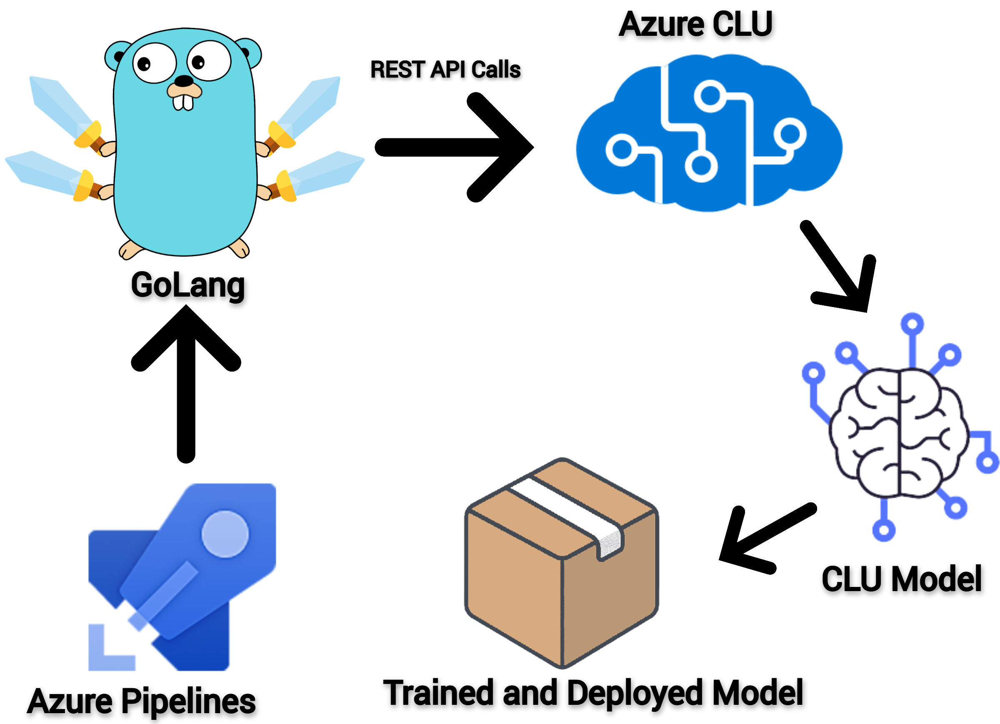

# Azure CLU Model Deployment With GoLang Using Promotion Deployment Approach


This repository contains GoLang module to create somehow a custom azure pipline task that can migrate and deploy CLU model across environments making use of promotion deployment approach. By promotion it means thatin agile software engineering environment where we are having multiple replicated environments(lower and production) which serves to continuously integrate and deliver software delivery. Machine learning operationsshould not be left behind in following this agile methodology.In order to support this we have taken into account azure language service's service(azure clu) to take part to implement smooth continuos integration and delivery and deployment of models in which the ML developers(working on azure CLU) after developing the model in lower environments need that to be promoted to other environments and hence all the way to production. The two environments in this module are labeled as "src-env" and "dst-env".

This module make use of core azure CLU rest apis to implement the above mentioned purpose. GoLang "http" package is the heart of this module which is mainly doing the stuff. The flow of the executed golang module is as follows:

* export the CLU model along with intents,entities and datasets from source environment.
* import it to the destination environment.
* train the model with the associated dataset.
* deploy the trained model onto the target environment

This whole process involves heavy marshalling and unmarshalling of JSON reponses to and fro. Furthermore, this module need some flag arguments to be provided as part of inputs to make this module as much dynamic and paramaterized as possible. The command line flag arguments that need to be provided during execution of this module are:

* projects(it is a list flag that need comma separated names of projects from source environment to be migrated to the destination environment)
* vnext-language-endpoint(the azure language service endpoint to migrate the project/s from)
* uat-language-endpoint(the azure language service endpoint to migrate the project/s to)
* vnext-key(the access key of the azure language service to migrate the project/s from)
* uat-key(the access key of the azure language service to migrate the project/s to) 


## Runbook

#### Prerequisites

* The Azure language service resources needs to be provisioned beforehand running this module. 
* Golang version 1.19.x or above.

A step by step guide is as follows:

clone this repository by running:
```sh
git clone https://github.com/Qumber-ali/azgo-clu.git
```
After cloning the repository run the following command on the root of repository to resolve dependencies and build the executable:
```golang
go get -d ./... && go build main.go
```

After building the executable you are ready to go.

Finally run the following command to start MLOps in action:
<br />  

```golang
./main --projects=<comma separted list of projects to migrate> --src-env <name of source environment> --dst-env <name of destination envrionment> --src-key <source environment's azure language service access key> --dst-key <target environment's azure language service access key> --src-language-endpoint <source environment's azure language service endpoint> --dst-language-endpoint <destination environment's azure language service endpoint>
```
<br />  

Note you can also move this binary to path that is enrolled in "PATH" environment variable or you can append the binary's path into PATH environment variable to call the executable from anywhere on your filesystem.
